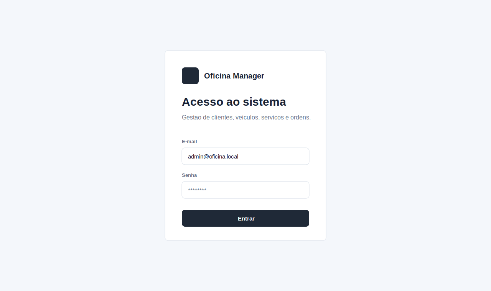
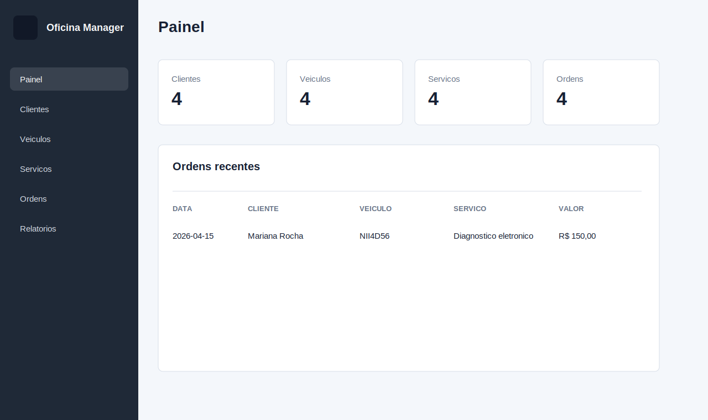
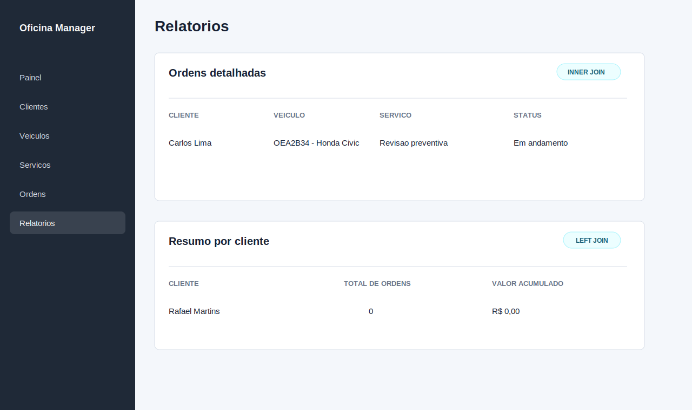

# Oficina Manager

Aluno: **Carlos Gabriel Raposo Landim**
Instituicao: **UNIFSA**

Sistema web para gestao de uma oficina mecanica. A aplicacao permite controlar clientes, veiculos, servicos e ordens de servico, com login, CRUD completo, filtros, ordenacao e relatorios com consultas usando `INNER JOIN` e `LEFT JOIN`.

## Tecnologias utilizadas

- Python 3
- Flask
- PostgreSQL
- psycopg2
- HTML e CSS

## Modelagem do banco

O banco possui 5 tabelas: `usuarios`, `clientes`, `veiculos`, `servicos` e `ordens_servico`.

- `clientes` 1:N `veiculos`
- `veiculos` 1:N `ordens_servico`
- `servicos` 1:N `ordens_servico`

O DER esta disponivel em:

- `diagrama/der_oficina_mecanica.svg`
- `diagrama/der_oficina_mecanica.mmd`

## Prints da aplicacao

### Tela de login



### Menu principal



### Consulta com JOIN



## Como executar

1. Crie e ative um ambiente virtual:

```powershell
python -m venv .venv
.\.venv\Scripts\activate
```

2. Instale as dependencias:

```powershell
pip install -r requirements.txt
```

3. Crie o arquivo `.env` a partir do exemplo:

```powershell
copy .env.example .env
```

4. Crie e alimente o banco PostgreSQL:

```powershell
psql -U postgres -f ddl/00_create_database.sql
psql -U postgres -d oficina_db -f ddl/01_create_schema.sql
psql -U postgres -d oficina_db -f dml/01_seed_data.sql
```

5. Execute a aplicacao:

```powershell
python src/app.py
```

6. Acesse no navegador:

```text
http://127.0.0.1:5000
```

Observacao: esse endereco e **local**, ou seja, funciona na maquina em que a aplicacao estiver rodando. O GitHub nao hospeda automaticamente uma aplicacao Flask com PostgreSQL.

## Credenciais de teste

```text
E-mail: admin@oficina.local
Senha: admin123
```

## Funcionalidades

- Login inicial obrigatorio.
- CRUD completo nos modulos de clientes, veiculos, servicos e ordens de servico.
- Filtros por texto, status e ordenacao.
- Relatorio com `INNER JOIN` entre ordens, veiculos, clientes e servicos.
- Relatorio com `LEFT JOIN` para listar todos os clientes, inclusive os que ainda nao possuem ordens.

## Estrutura do projeto

```text
/
|-- diagrama/
|-- ddl/
|-- dml/
|-- dql/
|-- prints/
|-- src/
|   |-- static/
|   |-- templates/
|   |-- app.py
|   |-- db.py
|   |-- security.py
|-- README.md
|-- requirements.txt
```

## Link do video

[Video demonstrativo](video/video_editado_final_sem_erros.mp4)
